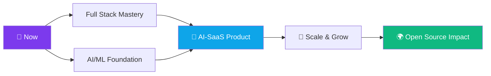

# 💫 About Me:
<br>👯 I’m looking to collaborate on AI-powered tools & SaaS products<br>🤝 I’m looking for help with scaling products & growth strategies<br>🌱 I’m currently learning Full Stack and Ai/ML<br>💬 Ask me about Full Stack and Data structure and Algorithms<br>⚡ Fun fact


## 🌐 Socials:
[![Instagram](https://img.shields.io/badge/Instagram-%23<div align="center">

<!-- Dynamic Glitch Header -->


<!-- Animated Typing SVG -->


<br/>

<!-- Profile Views + Social Badges Row -->
<a href="https://www.linkedin.com/in/abhishek-chopra-b58144322">
  
</a>
&nbsp;
<a href="https://instagram.com/abhishek___chopra18">
  
</a>
&nbsp;
<a href="https://github.com/Abhishek240514">
  
</a>
&nbsp;


</div>

---

<!-- About Me - Bento Box Style -->
## 🧬 The Stack Behind the Dev

```
┌─────────────────────────────────────────────────────────────────┐
│  👤  Abhishek Chopra                                            │
│  🎯  Full Stack Dev in progress × AI/ML enthusiast             │
│  🌱  Currently: Mastering Full Stack + diving deep into AI/ML  │
│  🤝  Seeking: Collaboration on AI-powered SaaS products        │
│  🔍  Help wanted: Scaling products & growth strategies         │
│  ⚡  Superpower: DSA + Full Stack — ask me anything!          │
│  🎮  Fun fact: I debug in the shower                           │
└─────────────────────────────────────────────────────────────────┘
```

<table>
<tr>
<td width="50%" valign="top">

### 🚀 What I'm Building
- 🤖 **AI-powered tools** that actually solve problems
- 🌐 **Full Stack SaaS** products end-to-end
- 📊 **Data pipelines** and ML experiments
- 🔗 **Open Source** — making code better together

</td>
<td width="50%" valign="top">

### 🧠 Current Learning Arc
```
Full Stack     ████████░░  80%
AI / ML        ██████░░░░  60%
DSA            █████████░  90%
System Design  █████░░░░░  50%
```

</td>
</tr>
</table>

---

## ⚡ Tech Arsenal

### 🔤 Languages
<p>


</p>

### 🌐 Frontend & Backend
<p>


</p>

### 🗄️ Databases
<p>


</p>

### 🤖 AI / ML & Data Science
<p>


</p>

---

## 📊 GitHub Command Center

<div align="center">

<!-- Stats Row -->


<!-- Streak -->
<br/>


<!-- Activity Graph -->
<br/>


</div>

---

## 🏆 Achievements & Goals

<div align="center">


</div>

---

## 🎯 2025 Roadmap



---

## 💡 Philosophy

<div align="center">

> *"The best way to predict the future is to build it."*
>
> — writing code, breaking things, fixing them, shipping anyway 🚀

</div>

---

## 🤝 Let's Connect & Collaborate

<div align="center">

<table>
<tr>
<td align="center">
  <a href="https://www.linkedin.com/in/abhishek-chopra-b58144322">
    
  </a>
</td>
<td align="center">
  <a href="https://instagram.com/abhishek___chopra18">
    
  </a>
</td>
<td align="center">
  <a href="https://github.com/Abhishek240514">
    
  </a>
</td>
</tr>
</table>

<br/>

**Open to:** AI-powered SaaS collabs · Open Source contributions · Learning partnerships · Hackathons

</div>

---

<div align="center">


<sub>⚡ Crafted with curiosity, caffeine & countless compile errors · Last updated 2025</sub>

</div>E4405F.svg?logo=Instagram&logoColor=white)](https://instagram.com/abhishek___chopra18) [](https://linkedin.com/in/abhishek-chopra-b58144322) 

# 💻 Tech Stack:
             
# 📊 GitHub Stats:
<br/>
<br/>


---
[](https://visitcount.itsvg.in)

<!-- Proudly created with GPRM ( https://gprm.itsvg.in ) -->
